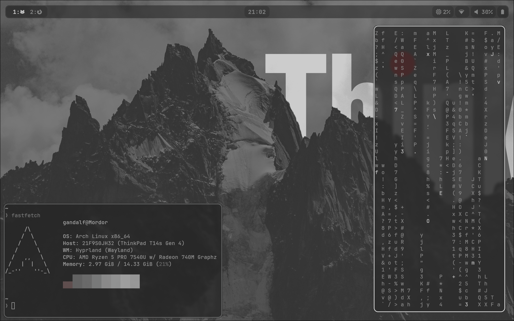
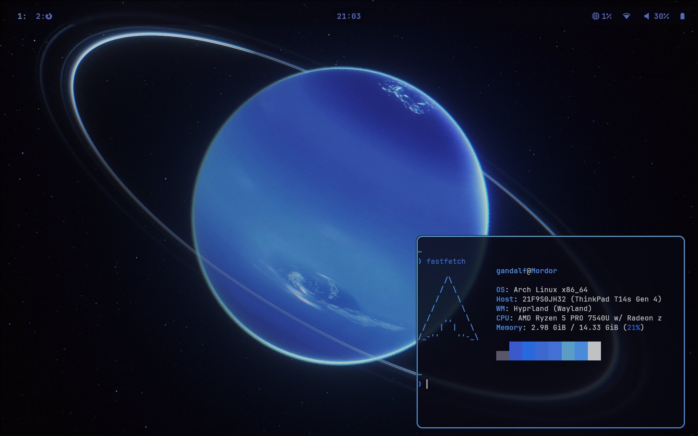
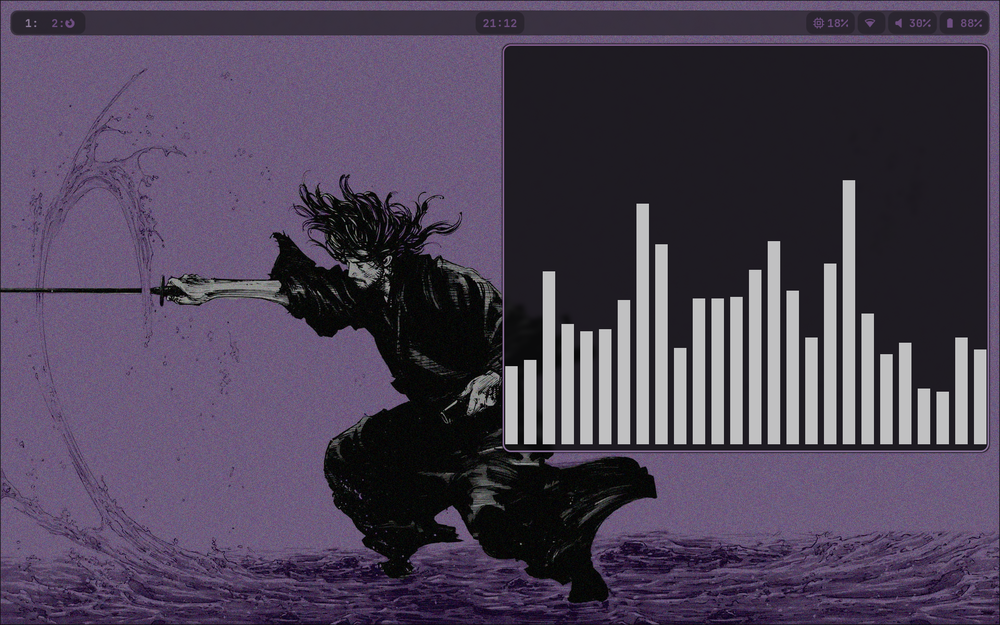

# Deddeland

---

## why

I created these dotfiles with the aim of making a minimal (I think) Unix porn-proof ( :D ) Hyprland configuration because I didn't like many other configs.

For these dotfiles, I used Pywal16, but with a little effort (and patience), it can be easily swapped with Wallust and Hellwal. I used Pywal16 because it works well for my system, but in the future, I might consider swapping it out.

⚠ Temporarily use your favorite GTK theme ⚠

## screenshots

## todo

- [x] installation script

- [ ] better wlogout (or change it)

- [ ] dunst (better (now it's not using pywal))

- [ ] wofi (better (now it's meh))

- [ ] understand why Pywal doesn't change the previous prompt color

- [x] pywalfox

- [ ] GTK (idk if it's even possible)

- [ ] spicetify (?)

- [ ] nvim (nvChad with pywal)

- [x] vesktop

- [ ] micro (?)

- [x] btop

- [ ] cava (?)
